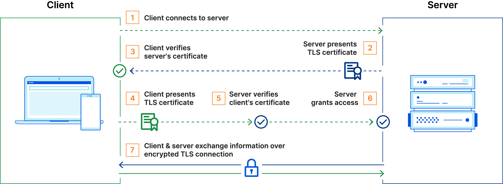

# mTLS Authentication

[](https://www.cloudflare.com/resources/images/slt3lc6tev37/5SjaQfZzDLEGqyzFkA0AA4/d227a26bbd7bc6d24363e9b9aaabef55/how_mtls_works-what_is_mutual_tls.png)<br/><br/>

## Certificates

1.  Certificate Authority (CA)

    - This is a trusted entity which issues SSL certificates
    - Organizations implementing mTLS act as their own certificate authority

    ```sh
    cd certificates/ca/

    openssl genpkey -algorithm RSA -out ca-key.pem  #generate CA's private key

    openssl req -x509 -new -nodes -key ca-key.pem -sha256 -days 365 -out ca-cert.pem -config openssl.cnf  #generate CA's certificate
    ```

2.  Server's Certificates

    - To authenticate server to the client
    - Certificate signing request (CSR) contains metadata about the entity requesting the certificate, eg->Common Name, Org, Country, etc., the things we have defined in `.cnf` files

    ```sh
    cd ../server/

    openssl genpkey -algorithm RSA -out server-key.pem  #server's private key

    openssl req -new -key server-key.pem -out server.csr -config server_openssl.cnf #csr

    openssl x509 -req -in server.csr -CA ../ca/ca-cert.pem -CAkey ../ca/ca-key.pem -CAcreateserial -out server-cert.pem -days 365 -sha256 #certificate signed by the CA

    ```

3.  Client's Certificates

    - To authenticate client to server

    ```sh
    cd ../client/

    openssl genpkey -algorithm RSA -out client-key.pem  #client's private key

    openssl req -new -key client-key.pem -out client.csr -config client_openssl.cnf #csr

    openssl x509 -req -in client.csr -CA ../ca/ca-cert.pem -CAkey ../ca/ca-key.pem -CAcreateserial -out client-cert.pem -days 365 -sha256 #certificate signed by the CA
    ```

4.  Prepare a server

    - Pick something from [Spring Initializer](https://start.spring.io/)
    - We need to prepare a `keystore` and a `truststore` now

    ```sh
    export keystorePass=12345678
    export truststorePass=12345678
    ```

    ```sh
    cd ../

    openssl pkcs12 -export -out server.p12 -inkey ./server/server-key.pem -in ./server/server-cert.pem -name server -passout pass:$keystorePass #keystore

    keytool -import -file ./ca/ca-cert.pem -alias ca -keystore truststore.jks -storepass $truststorePass -noprompt  #truststore
    ```

    - Put your freshly generated keystore and truststore into your server's resources folder
    - `application.yml` should look something like this by now

    ```yml
    spring:
      application:
        name: basic-server
    server:
      port: 4000
      ssl:
        enabled: true
        key-store-type: PKCS12
        key-store: classpath:server.p12
        key-store-password: 12345678
        key-alias: server
        trust-store-type: JKS
        trust-store: classpath:truststore.jks
        trust-store-password: 12345678
        client-auth: need
    ```

    - Create a basic endpoint and run it. Our backend setup is complete with this.

## Testing

- ### terminal:

  ```sh
  curl --cacert ./ca/ca-cert.pem --cert ./client/client-cert.pem --key ./client/client-key.pem https://localhost:4000/base-api
  ```

- ### postman

  - Need to create a common `.pfx` file having both client certificate and key

    ```sh
    export postmanPass=my-postman-pass

    openssl pkcs12 -export -out ./client/client-combined-for-postman.pfx -inkey ./client/client-key.pem -in ./client/client-cert.pem -certfile ./ca/ca-cert.pem -passout pass:$postmanPass
    ```

  - postman > settings > certificates tab > client certificates > add Certificate
  - Add host, port, pfx file and passphrase
  - postman should work fine now
